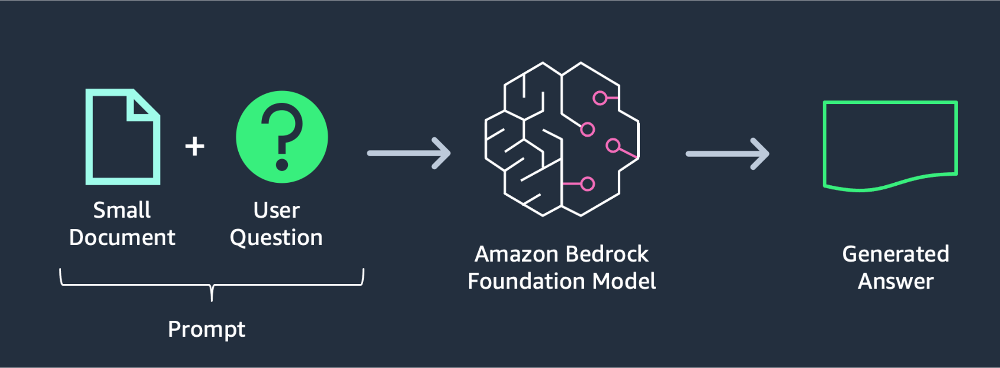

# HR Luminary

## Overview
**HR Luminary** is an AI-powered recruitment assistant designed to streamline and enhance the recruitment process. This project utilizes Amazon Bedrock and the Anthropic Claude model, integrated with the LangChain library, to provide advanced capabilities in candidate evaluation, resume screening, and interview assistance. HR Luminary is a demonstration of how AI can be leveraged to improve efficiency and decision-making in human resources.

For more information about the underlying technologies, please refer to:
- [Amazon Bedrock](https://aws.amazon.com/bedrock/)
- [Anthropic Claude 3](https://www.anthropic.com/index/claude-2)

## Setup Guide

### Prerequisites
Before setting up HR Luminary, ensure you have the following:
- **Python** installed on your system. If not, follow the instructions [here](https://docs.python-guide.org/starting/install3/linux/).
- **AWS CLI** installed and configured. Follow the quickstart guide [here](https://docs.aws.amazon.com/cli/latest/userguide/getting-started-quickstart.html).
- An **AWS account** to access Amazon Bedrock services.

### Step 1: Set up a Python Virtual Environment
Creating a virtual environment helps manage dependencies and avoid conflicts.

1. Open your terminal.
2. Run the following commands to create and activate a virtual environment:
   ```bash
   python3 -m venv hr-luminary-env
   source hr-luminary-env/bin/activate
   ```

### Step 2: Clone the Repository
Clone the HR Luminary repository to your local machine.

1. Run the following commands:
   ```bash
   git clone https://github.com/awsstudygroup/HR-GenAI
   cd HR-GenAI
   ```

### Step 3: Install Dependencies
Install the necessary Python packages listed in the `requirements.txt` file.

1. Ensure your virtual environment is activated.
2. Run the following command:
   ```bash
   pip3 install -r requirements.txt
   ```

### Step 4: Configure AWS Credentials
Ensure your AWS CLI is configured with the necessary credentials to access Amazon Bedrock.

1. Run:
   ```bash
   aws configure
   ```
2. Enter your AWS Access Key, Secret Key, Region, and Output format.

### Step 5: Run the Application
Start the HR Luminary application using Streamlit.

1. Run the following command:
   ```bash
   streamlit run Home.py --server.port 8080
   ```
2. Open your browser and navigate to `http://localhost:8080` to interact with the application.

## Architecture
The architecture of HR Luminary is designed to seamlessly integrate AI models with a user-friendly interface, enabling effective recruitment management. Below is an overview of the architecture:



## Learn More About Prompt Design
- Enhance the efficiency of AI models in HR Luminary by learning about prompt design [here](https://docs.anthropic.com/claude/docs/introduction-to-prompt-design).

## Contributing
We welcome contributions to HR Luminary! To contribute:

1. **Fork the Repository**: Create a copy of the repository in your GitHub account.
2. **Create a New Branch**: Use a descriptive name for your branch:
   ```bash
   git checkout -b feature-or-bugfix-name
   ```
3. **Make Changes**: Commit your changes with clear messages:
   ```bash
   git add .
   git commit -m "Description of your changes"
   ```
4. **Push Changes**: Push to your forked repository:
   ```bash
   git push origin feature-or-bugfix-name
   ```
5. **Open a Pull Request**: Provide a detailed description of your changes when opening a pull request.

## License
HR Luminary is licensed under the MIT License. See the [LICENSE](./LICENSE) file for more details.

